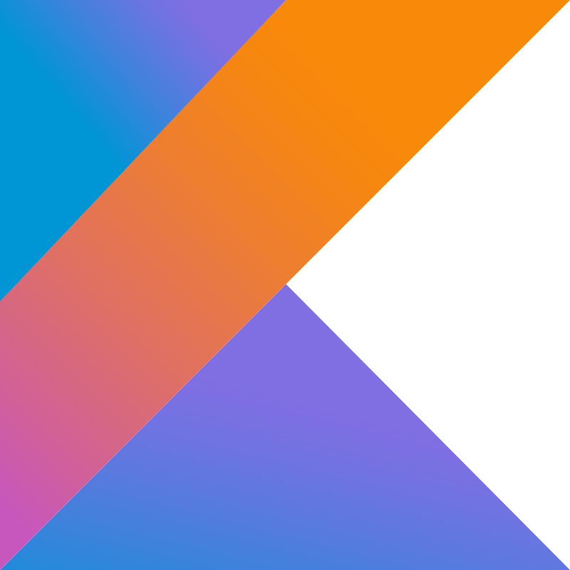
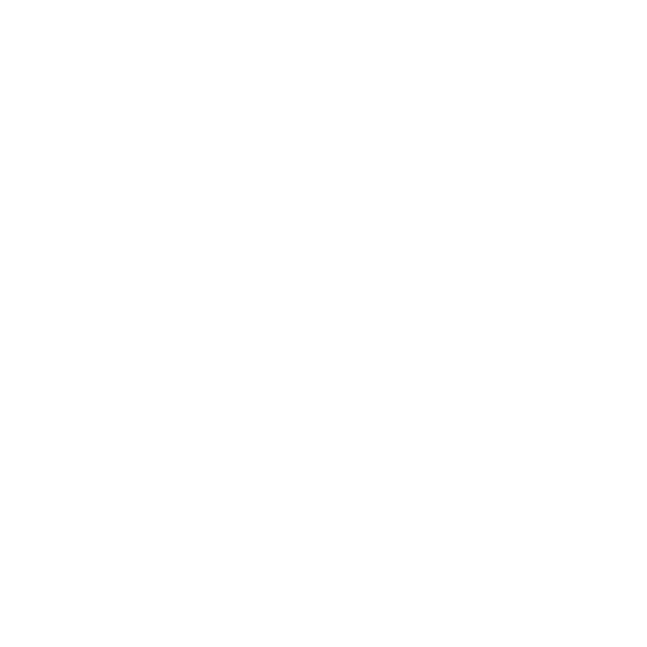

  

<pre style="background: #000000ff; color: #cdd6f4; border-radius: 16px; padding: 20px; border: 1.5px solid #313244; font-family: 'Fira Code', 'Courier New', monospace; font-size: 15px; line-height: 1.6; text-align: left; max-width: 800px; margin: 0 auto;">
$ profile --user shravan
{
  "focus": ["Model Context Protocol (MCP)", "Multi-Agent Pipelines"],
  "stack": ["React / TypeScript", "Python / Cloud-Native"],
  "motto": "Everything is RELATIVE..."
}
</pre>

---

<pre style="background: #000000ff; color: #a6e3a1; border-radius: 16px; padding: 20px; border: 1.5px solid #313244; font-family: 'Fira Code', monospace; font-size: 14px; line-height: 1.5; text-align: left; max-width: 800px; margin: 0 auto;">
SHRVAN-CORE BIOS V4.07 (C) 2026 SHRVAN4507 CORP.
-------------------------------------------------
CPU: COGNITIVE AGENTIC PROCESSOR @ 5.00GHz
RAM: 64GB SYSTEM MEMORY TEST... OK

DETECTING INTERFACES:
- DEVICE 0: MODEL CONTEXT PROTOCOL (MCP) -> [ACTIVE]
- DEVICE 1: CLAUDE AI WORKSPACE LINK     -> [ESTABLISHED]
- DEVICE 2: GEMINI DYNAMIC CORE          -> [CONNECTED]
- DEVICE 3: FULL-STACK WEB INSTANCE      -> [ONLINE]

ERROR DETECTED: Kernel Panic avoided. Motto: "Everything is RELATIVE..."
BOOT SEQUENCE INITIATED...
</pre>

---

## COMPATIBILITY_LAYER

  
  
  
  
  
  
  
  
  
  
  
  
  
  
  
  
  
  
  
  
  
  
  
  
  
  
  
  
  
  
  
  
  

---

## SYSTEM_ANALYTICS

  
  

  

---

### -.- CONTRIBUTION_SNAKE

  <picture>
    <source media="(prefers-color-scheme: dark)" srcset="https://raw.githubusercontent.com/Shravan4507/Shravan4507/output/github-contribution-grid-snake-dark.svg" />
    <source media="(prefers-color-scheme: light)" srcset="https://raw.githubusercontent.com/Shravan4507/Shravan4507/output/github-contribution-grid-snake.svg" />
    
  </picture>

---

### -.- FREQUENCY_SYNC

  

---

## CURRENT_FOCUS

<pre style="background: #000000ff; color: #cdd6f4; border-radius: 16px; padding: 20px; border: 1.5px solid #313244; font-family: 'Fira Code', 'Courier New', monospace; font-size: 14px; line-height: 1.6; text-align: left; max-width: 800px; margin: 0 auto;">
$ cat current_focus.json
{
  "agentic_ai": ["Model Context Protocol (MCP)", "Multi-Agent Pipelines", "Autonomy"],
  "front_end":  ["React", "Vite", "TypeScript", "Fluid UX Micro-Animations"],
  "back_end":   ["Firebase", "Google Cloud Platform (GCP)", "AWS", "Azure"]
}
</pre>

---

<pre style="background: #000000ff; color: #cdd6f4; border-radius: 16px; padding: 15px; border: 1.5px solid #313244; font-family: 'Fira Code', monospace; font-size: 13px; text-align: center; max-width: 800px; margin: 0 auto; line-height: 1.6;">
[SYSTEM INFO] Open to collaborating on Agentic AI, Full-Stack, and Systems-focused projects.
[STATUS] "Everything is RELATIVE..."
[ACTION] If you find something useful here, consider giving it a ⭐!
</pre>

 

