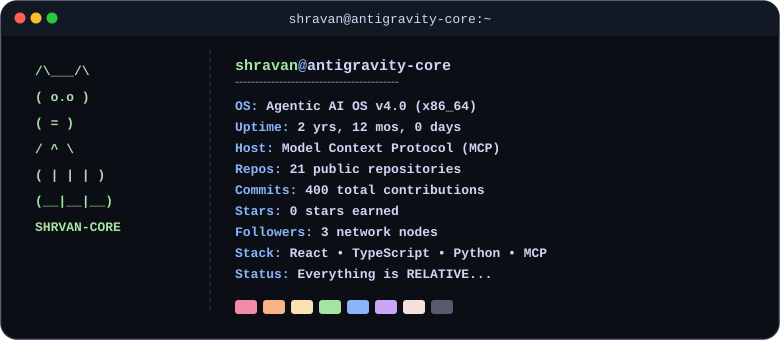

  <picture>
    <source media="(prefers-color-scheme: dark)" srcset="./assets/neofetch_dark.svg" />
    <source media="(prefers-color-scheme: light)" srcset="./assets/neofetch_light.svg" />
    
  </picture>

  
  
  
  
  

---

### ⚡ SYSTEM_BIOS & CORE STATUS

<pre style="background: #0b0e14; color: #cdd6f4; border-radius: 16px; padding: 22px; border: 1.5px solid #1f293d; font-family: 'Fira Code', 'Courier New', monospace; font-size: 14px; line-height: 1.6; text-align: left; max-width: 800px; margin: 0 auto;">
$ profile --user shravan --status
{
  "identity": "Full-Stack Engineer & Agentic AI Architect",
  "focus": ["Model Context Protocol (MCP)", "Multi-Agent Systems", "React Apps"],
  "stack": ["React / Vite / TypeScript", "Python / Cloud Infrastructure"],
  "philosophy": "Everything is RELATIVE..."
}
</pre>

---

### 🛠️ COMPATIBILITY_LAYER & TECH MATRIX

#### 💻 Frontend & Core Stack

  
  
  
  
  
  

#### ☁️ Backend, Cloud & Infra

  
  
  
  
  
  
  
  

#### 🤖 AI & Agentic Ecosystem

  
  
  
  
  
  
  
  

#### ⚙️ Tools & Workspaces

  
  
  
  

---

### 📊 SYSTEM_ANALYTICS

  
  

  

---

### 🐍 CONTRIBUTION_SNAKE

  <picture>
    <source media="(prefers-color-scheme: dark)" srcset="https://raw.githubusercontent.com/Shravan4507/Shravan4507/output/github-contribution-grid-snake-dark.svg" />
    <source media="(prefers-color-scheme: light)" srcset="https://raw.githubusercontent.com/Shravan4507/Shravan4507/output/github-contribution-grid-snake.svg" />
    
  </picture>

---

### 📡 FREQUENCY_SYNC & DISCORD PRESENCE

  

---

### 🎯 CURRENT_FOCUS

<pre style="background: #0b0e14; color: #cdd6f4; border-radius: 16px; padding: 20px; border: 1.5px solid #1f293d; font-family: 'Fira Code', 'Courier New', monospace; font-size: 14px; line-height: 1.6; text-align: left; max-width: 800px; margin: 0 auto;">
$ cat current_focus.json
{
  "agentic_ai": ["Model Context Protocol (MCP)", "Multi-Agent Orchestration", "Autonomous Systems"],
  "web_stack":  ["React", "Vite", "TypeScript", "Vanilla CSS Micro-Animations"],
  "cloud_infra": ["Firebase", "Google Cloud Platform (GCP)", "Vercel Deployment"]
}
</pre>

---

<pre style="background: #0b0e14; color: #cdd6f4; border-radius: 16px; padding: 15px; border: 1.5px solid #1f293d; font-family: 'Fira Code', monospace; font-size: 13px; text-align: center; max-width: 800px; margin: 0 auto; line-height: 1.6;">
[SYSTEM INFO] Open to collaborating on Agentic AI, Full-Stack Web, and Cloud-Native projects.
[STATUS] "Everything is RELATIVE..."
[ACTION] Drop a ⭐ if you find anything inspiring here!
</pre>

 

